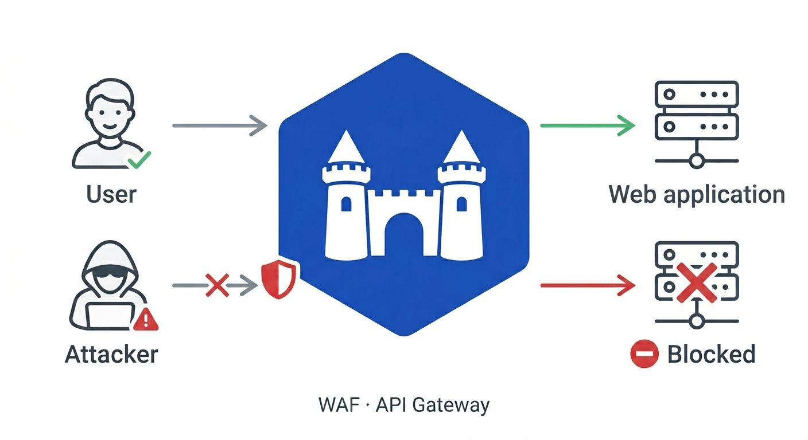

<p align="center">
  
</p>

<p align="center">
  Barbacana secure by default and simple by design.
</p>

# Barbacana

Barbacana is an open-source WAF and API security gateway. It protects your web applications and APIs with ease.

A Web Application Firewall ([WAF](https://en.wikipedia.org/wiki/Web_application_firewall)) sits between the internet and your application. It inspects every HTTP request for known attack patterns — SQL injection, cross-site scripting, command injection, path traversal, and hundreds more — and blocks malicious requests before they reach your code.

<p align="center">
  
</p>

## Quickstart

Write a minimal config:

```yaml
# waf.yaml
version: v1alpha1

routes:
  - upstream: http://app:8000
```

Run it with Docker:

```bash
docker run --rm -p 8080:8080 \
  -v $(pwd)/waf.yaml:/etc/barbacana/waf.yaml:ro \
  ghcr.io/barbacana-waf/barbacana:latest serve
```

Barbacana listens on `:8080`, checks incoming requests against OWASP CRS (250+ rules), and forwards only safe traffic to your app running at `app:8000`. SQL injection, XSS, remote code execution, path traversal, and protocol attacks are all blocked by default.

## Why Barbacana?

**Secure the moment you deploy.** Every protection is on from the first request. No rules to download, no policies to write, no security expertise required.

**Configure in YAML, not rule syntax.** Routes, content types, and exceptions are all human-readable. You disable `sql-injection-union` on a route with false positives — not `SecRuleRemoveById 942100`.

**One container, nothing else.** No databases, no dashboards, no payments, no cloud accounts. Pull the image, point it at your app, done.

**Auto-HTTPS included.** Add a hostname and Barbacana provisions a [Let's Encrypt certificate](https://caddyserver.com/docs/automatic-https) automatically. HTTPS, HTTP-to-HTTPS redirect, and certificate renewal — zero configuration. No more excuses for leaving your app exposed over plain HTTP.

## Configuration

Real apps need more than one route. Here's a deployment with three:

```yaml
# waf.yaml
version: v1alpha1
host: example.com  # auto-TLS for this fully qualified domain name (FQDN)

routes:
  - id: api
    match:
      paths: ["/api/*"]
    upstream: http://api:8000
    accept:
      content_types: [application/json]
      methods: [GET, POST]
    rewrite:
      strip_prefix: /api
    openapi:
      spec: /specs/api.yaml
    disable:
      - sql-injection-union    # exception to prevent false positives

  - id: uploads
    match:
      paths: ["/upload/*"]
    upstream: http://uploads:8000
    accept:
      content_types: [multipart/form-data]
    multipart:
      file_limit: 20
      allowed_types: [image/png, image/jpeg, application/pdf]

  - id: everything-else
    upstream: http://app:8000
```

Routes are matched top-to-bottom:

- **`api`** — paths under `/api/*` go to the API service. Only JSON `GET`/`POST` requests are accepted, the `/api` prefix is stripped before forwarding, requests are validated against an OpenAPI spec, and only one exception (`sql-injection-union`) is required for this route only.
- **`uploads`** — paths under `/upload/*` accept multipart form data only, capped at 20 files per request and restricted to images and PDFs.
- **`everything-else`** — a catch-all for the rest of the app.

The full protection list, configuration reference, TLS setup, and production deployment guide are in [`docs/design/`](docs/design/). Example configs live in [`configs/`](configs/).

## Built on

- [Caddy](https://caddyserver.com) — HTTP server, TLS, HTTP/2, HTTP/3, reverse proxy
- [Coraza](https://coraza.io) — WAF engine (pure Go, no CGO)
- [OWASP CRS v4](https://coreruleset.org) — attack detection rules

Barbacana wraps all three so you don't have to learn any of them.

## License

Apache 2.0
